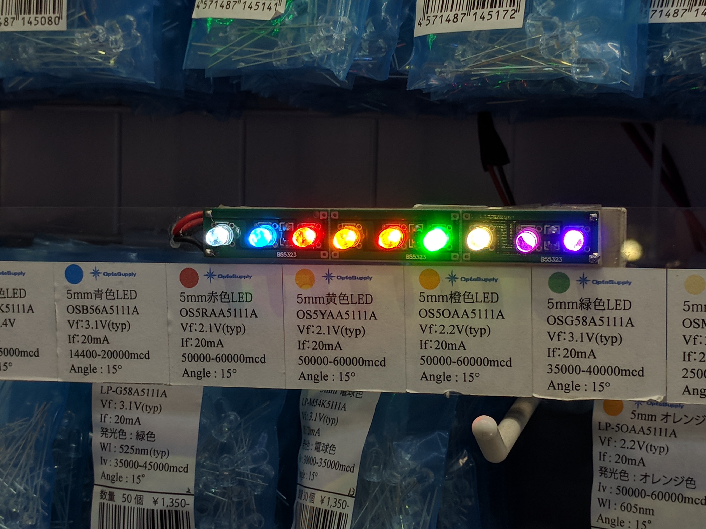
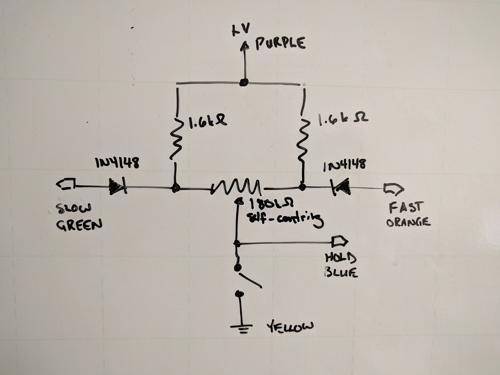

# What's This?

In the 1980's I built a binary clock (BCD) kit by Active Surplus.  They were located on Queen St. W. in Toronto.  It never worked, and recently I decided to try to figure out why.  The reason was simple:  I had put all the LEDs in backwards.  Instead of removing and then reinstalling the original ones, I decided to replace them with new LEDs in case the soldering/desoldering/resoldering was shortening their life.  The result was the clock was incredibly bright.  Far too bright to even look at without hurting your eyes.  I had to figure out how to reduce the current flowing through the LEDs, so I traced out the circuit to learn which resistor did what.

Afterwards, since I had the schematic drawn up, I decided to practice PCB work and make my own layout.  First I traced out something resembling Active Surplus' version, then I tried cleaning it up and reorganizing the parts.  I ended up with something I liked much more than the original.  The traces are almost entirely on the top side of the PCB so they are visible when the clock is on display, and they are organized and flow in a way that visually illustrates how the circuit works.  The traces were quite randomly placed in Active Surplus' version, which made figuring out which resistor did what such a challenge.

Eventually I found one of the old clock chips for sale and decided to make a brand new clock.  The kit from Active Surplus used an MM5315 clock chip, but what I found for sale was an MM5311, and that required a new PCB layout.  That's what I ended up actually making.  An MM5309 can be substituted for an MM5311 if that's easier to find.  It's a drop-in replacement, it changes the 3rd input function from "HOLD" to "RESET".  The MM5315 used in the original kit provides both "HOLD" and "RESET" functions.  An MM5313 could also be used, it's almost identical to the MM5315.

This is a record the final result in case it would entertain others to make one, too.

## Photos

## Parts List

Where I changed the circuit from the original, the original components are shown, and my subsitutes are in parentheses.  The changes are due to the lower current that modern LEDs require to deliver a sensible amount of light:  need to use higher resistance series current limiting resistors, and can get away with lower-rated rectifier diodes in the power supply.

### Connectors

- 2x3 pin header
- 1x3 pin header
- 2 pin jumper
- 28 pin dip socket

### Passives

- 4x 100 Ohm 1/2 W resistor (new build = 1 kOhm 1/8 W)	<-- sets brightness
- 4x 10 kOhm 1/8 W resistor
- 1x 100 kOhm 1/8 W resistor
- 1x 470 kOhm 1/8 W resistor
- 2x 0.01 uF ceramic disc capacitor
- 1x 0.1 uF ceramic disc capacitor
- 1x 470 uF 25 V electrolytic capacitor

### Semiconductors

- 5x 1N4003 diode (new build = 1N4001)
- 10x MPS3638A PNP transistor (new build = 2N3906).  pin order, viewed from flat side, must be E-B-C
- 20x LED

### ICs

drop-in replacements:
- 1x MM5309 Digital Clock		<-- 3rd control is "RESET"
- 1x MM5311 Digital Clock		<-- 3rd control is "HOLD"

requires new board:
- MM5313:  adds 1 PPS output;  loses output enable pin.
- MM5315:  has four controls instead of 3 (both RESET and HOLD inputs);  loses
output enable pin.
